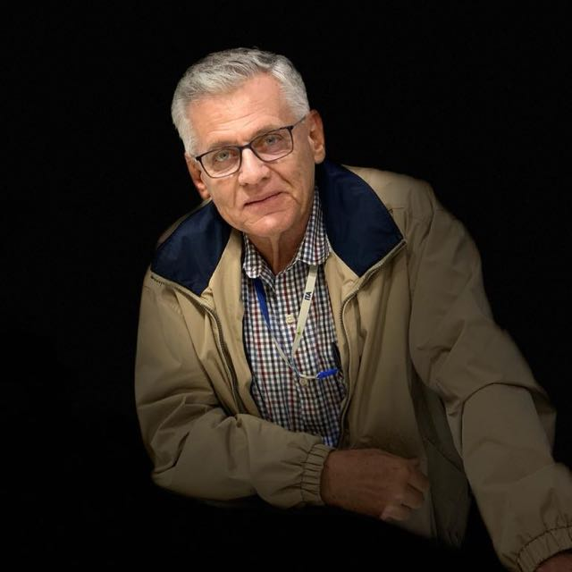
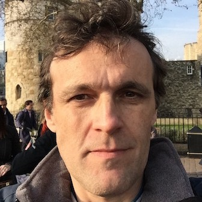
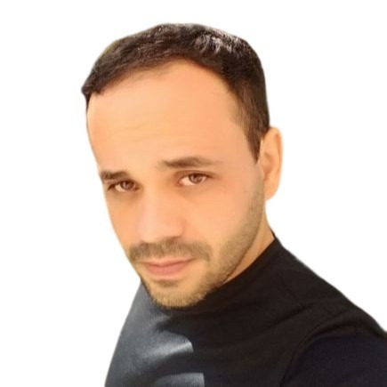
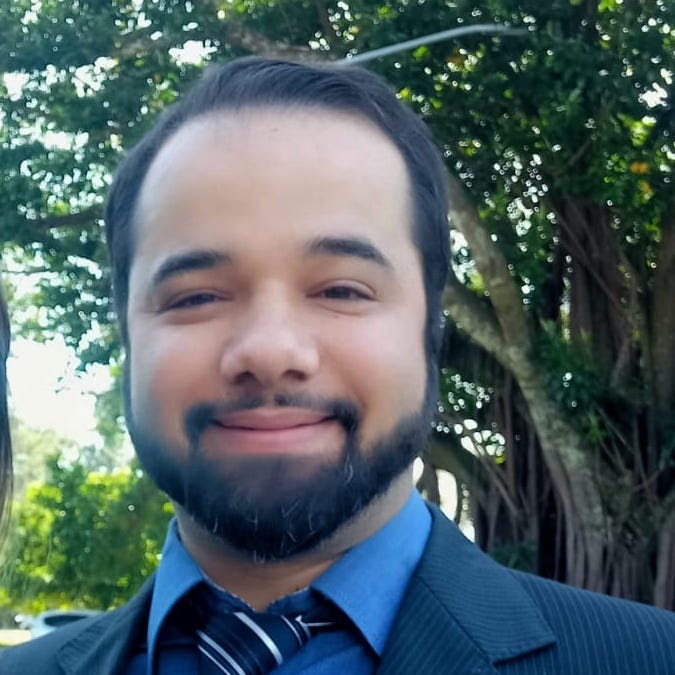

#### __[GP-ESAC] Grupo de Pesquisa em Engenharia e Sistemas Aeroespaciais Computacionais__
---

[Descrição do grupo de pesquisa](#descrição-do-grupo-de-pesquisa)

[Áreas de pesquisa](#Áreas-de-pesquisa)

[Tecnologias](#tecnologias)

[Projetos](#projetos)

[Membros](#membros)

[Agenda](#agenda)

[Atas de Reunião](./atas.md)

[Referências bibliográficas](#referências-bibliográficas)

[Arquivos Diversos](https://drive.google.com/drive/folders/13Hl7Iv3-r5UK0nvGRyARWiXcL_2oHc-_?usp=drive_link)

## Descrição do grupo de pesquisa 
__Grupo de Pesquisa em Engenharia e Sistemas Aeroespaciais Computacionais (GP-ESAC)__ é uma iniciativa colaborativa entre o __Instituto Tecnológico de Aeronáutica (ITA)__ e o __Instituto Nacional de Pesquisas Espaciais (INPE)__, estabelecida com o objetivo de promover pesquisa científica de excelência em nível de doutorado na área de engenharia aeroespacial e sistemas computacionais.

### Missão

Desenvolver pesquisas avançadas e inovadoras que contribuam para o avanço do conhecimento científico e tecnológico no setor aeroespacial brasileiro, integrando as competências acadêmicas do ITA com a expertise em pesquisa espacial do INPE.

### Objetivos

- __Formação de alto nível__: Capacitar doutores altamente qualificados através de projetos de pesquisa interdisciplinares e colaborativos
- __Inovação tecnológica__: Desenvolver soluções computacionais avançadas para desafios da engenharia aeroespacial
- __Integração institucional__: Fortalecer os laços de cooperação entre ITA e INPE, maximizando o aproveitamento de recursos e expertise
- __Impacto científico__: Produzir pesquisas de relevância internacional com aplicações práticas no setor aeroespacial

### Estrutura Colaborativa

O grupo reúne __professores doutores__ do ITA, __pesquisadores sênior__ do INPE e __estudantes de doutorado__ de ambas as instituições, criando um ambiente multidisciplinar que favorece a troca de conhecimentos e o desenvolvimento de pesquisas de fronteira. Esta sinergia permite abordar problemas complexos do setor aeroespacial com abordagens computacionais inovadoras, combinando rigor acadêmico com aplicabilidade prática.

### Diferenciais

- Acesso às infraestruturas de pesquisa de ambas as instituições
- Orientação conjunta por especialistas de reconhecimento nacional e internacional
- Projetos alinhados com as demandas estratégicas do setor aeroespacial brasileiro
- Oportunidades de colaboração com missões espaciais e projetos aeronáuticos reais

## Áreas de pesquisa
  - Sistemas embarcados de tempo real
  - Inteligência artificial
  - Big Data
  - Sensoriamento Remoto
  

## Tecnologias 

  
  

## Projetos

### Projeto Detecção de Nuvens

   

### Projeto Detecção de Focos de Incêndio

   

## Membros
### Professores

  
  <h4 style="margin: 10px 0; color: #2c3e50;"><a href="https://www.comp.ita.br/~cunha/" style="text-decoration: none; color: #2c3e50;">Prof. Dr. Adilson Marques da Cunha</a></h4>
  
Instituto Tecnológico de Aeronáutica (ITA)

  
PG-CTE-E / PG-EEC-I

  
  <h4 style="margin: 10px 0; color: #2c3e50;">Prof. Dr. Valdivino Alexandre de Santiago Júnior</h4>
  
Instituto Nacional de Pesquisas Espaciais (INPE)

  
LIAREA / COPDT

  
  <h4 style="margin: 10px 0; color: #2c3e50;">Dr. Walter Abrahão dos Santos</h4>
  
Instituto Nacional de Pesquisas Espaciais (INPE)

  
COIDS

### Alunos

  
  <h4 style="margin: 10px 0; color: #2c3e50;"><a href="https://stra-uss.github.io/" style="text-decoration: none; color: #2c3e50;">Doutorando Strauss Cunha Carvalho</a></h4>
  
Instituto Tecnológico de Aeronáutica (ITA)

  
PG-CTE-E

  
  <h4 style="margin: 10px 0; color: #2c3e50;"><a href="http://lattes.cnpq.br/2093996354767369" style="text-decoration: none; color: #2c3e50;">Doutorando Rodrigo Monteiro de Barros Santana</a></h4>
  
Instituto Tecnológico de Aeronáutica (ITA)

  
PG-CTE-E

---

## Reuniões

☑️ 📅 18-08-25 ⏰ 15H 📍 INPE

☑️ 📅 26-08-25 ⏰ 10H 📍 Online

## Referências bibliográficas

Copyright ©️ 2025 
